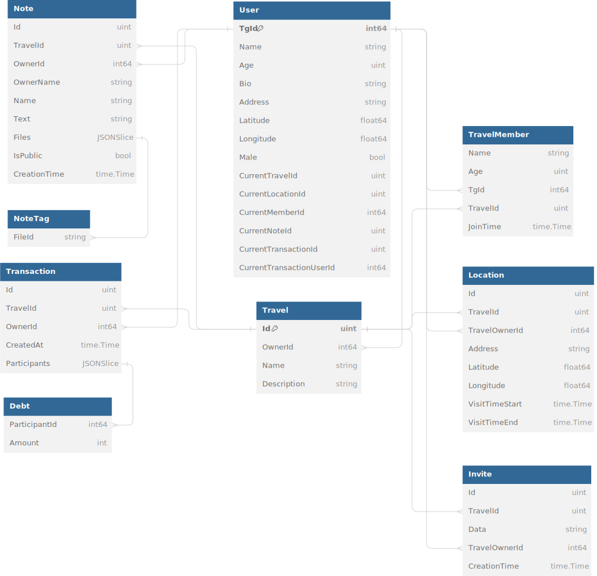

https://t.me/prod_travelAgent_bot

# Travel Agent 3.0 🌍

Путешествуйте с друзьями, найдите попутчиков, ведите заметки, планируйте маршрут, узнавайте погоду, открывайте новые
места и многое другое для вашего приключения!

## Установка 💻

Следуйте этим шагам, чтобы установить и запустить проект:

1. **Клонирование репозитория**
    ```
    git clone https://github.com/Central-University-IT-prod/backend-qushedo.git
    ```
2. **Переход в директорию проекта**
    ```
    cd backend-qushedo
    ```
3. **Сборка и запуск docker-compose**
    ```
    docker-compose up --build
    ```
4. **В дальнейшем можно запускать через**
    ```
    docker-compose up
    ```

## Использование 🕹️

Интерфейс спроектирован так, что пользователь может попасть из любой точки меню в любую другую точку меню. Любой сможет
интуитивно разобраться в нём.

### Важные команды

1. **Запуск бота**
    ```
    /start
    ```
2. **Отмена текущего ввода**
    ```
    /cancel
    ```

## [Демонстрация](https://youtu.be/Jr1awp513ok) 🎥

## Внешние интеграции 🔗

### Nominatim

Используется для преобразования адреса в координаты и наоборот. Выбор обусловлен тем, что данное API достаточно
качественное и является бесплатным.

### Graphopper

Используется для построения маршрута путешествий. Построение маршрутов реализовано через get запрос
на https://graphhopper.com/maps/. Полученная ссылка встраивается в telegram WebApp. Выбор WebApp обусловлен удобством
подобной реализации. Маршруты строятся практически моментально и являются интерактивными.

### OpenTripMap

Используется для получения информации о достопримечательностях. Абсолютно бесплатное api использующее OpenStreetMap.
Выбор обусловлен тем, что данное API достаточно качественное и является бесплатным.

### YandexTravels

Используется для отображения информации о билетах на поезда и автобусы. Реализовано через get запрос
на https://travel.yandex.ru/. Полученная ссылка встраивается в telegram WebApp. Выбор обусловлен удобством
использования, а так же тем, что это решение абсолютно бесплатно.

### TinkoffTravel

Используется для отображения информации о билетах на самолеты. Реализовано через get запрос
на https://www.tinkoff.ru/travel/flights/one-way/. Полученная ссылка встраивается в telegram WebApp. Выбор обусловлен
удобством использования, а так же тем, что это решение абсолютно бесплатно.

### YandexRestaurants

Используется для отображения информации о ресторанах в локации. Реализовано через get запрос
на https://yandex.ru/maps/213/moscow/search/{Город},рестораны/. Полученная ссылка встраивается в telegram WebApp. Выбор
обусловлен удобством использования, а так же тем, что это решение абсолютно бесплатно.

### HotelLook

Используется для отображения информации об отелях. Реализовано через get запрос на https://search.hotellook.com/hotels.
Полученная ссылка встраивается в telegram WebApp. Выбор обусловлен удобством использования, а так же тем, что это
решение абсолютно бесплатно.

### Почему был выбран Postgres

1. **Свободный доступ**: Postgres - это бесплатная система управления базами данных с открытым исходным кодом.
2. **Поддержка различных форматов данных**: Postgres поддерживает множество различных типов и структур данных, включая
   сетевые адреса, данные в текстовом формате JSON и геометрические данные для координат геопозиций.
3. **Работа с большими объемами данных**: Postgres способен эффективно работать с большими объемами данных.
4. **Соответствие требованиям ACID**: Postgres соответствует требованиям ACID (Atomicity, Consistency, Isolation,
   Durability), что обеспечивает надежность и целостность данных.
5. **Поддержка всех функций современных баз данных**: Postgres поддерживает все функции, которые есть в современных
   базах данных.

### Почему был выбран Gorm

Gorm был выбран как удобный инструмент для быстрого составления запросов к базе данных. Выбор Gorm обусловлен простотой
написания запросов, что помогло ускорить разработку.

### Почему был выбран фреймворк tuncnak/telebot

Выбор данного фреймворка обусловлен тем, что это единственный фреймворк для golang, обладающий правильным
структурированным синтаксисом для взаимодействия с telegram bot api.

## Схема телеграм бота

Перед началом разработки бота, был спроектирован его интерфейс через draw.io. Благодаря этому, интерфейс конечного
телеграм-бота строго структурирован и интуитивен. Во время разработки некоторые решения в интерфейсе были пересмотрены.
Схема находится в корне проекта, файл `bot_scheme.drawio`.

## Схема базы данных



## Заключение

Был разработан максимально удобный с точки зрения пользовательского опыта телеграм-бот. Реализации функционала не
требуют дополнительных финансовых вложений на их поддержку, эта цель и преследовалась мной при разработке.
